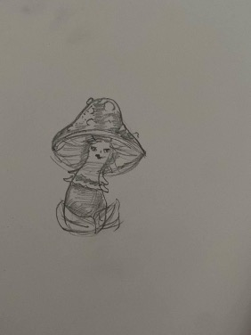
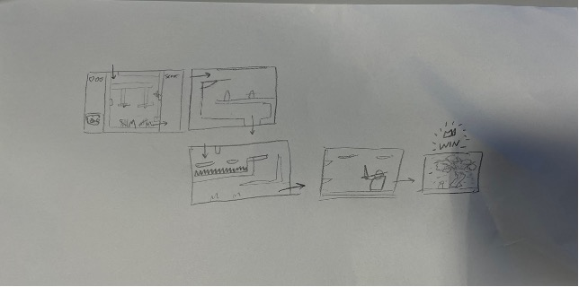

# MA1805 README #

# How to play:
- Use the arrow keys to make the player move
- If any player is touching an object with a collider, you can jump.
    (Currently, the coliders for the player are only in place for the jumping mechanic, there isn't any wall or ceiling detection yet)

## ·         A plan for narrative development.

The plan we have for our group project is that of expansion of our game. For example, as of right now we have one room which is a ninja dojo, one enemy type and one main character. We wish to make more rooms, more enemy types and more ways to attack the enemy.

## ·         An explanation of themes 

The theme that we would like to use and explore is a samurai/ninja/japanese type style, we will be using dojos and other places you would usually find a ninja or samurai in and we will be styling the attacks and character styles and outfits on how ninjas would attack and dress. 

## ·         MOODBOARD IMAGES

##  ·         A list of the group members and a detailed account of their duties/role in the development of the project.

Tom:
 In control of making the character inflict damage onto the enemies, creating invisible hitboxes by using rectangles for the enemies so that the player can successfully kill them (make them disappear).

Mark:
 Is taking the movement role, by making sure the player is able to jump onto objects within the map, run around the map to evade or attack enemies by using invisible rectangles that the player can jump on.

Daniel:
 Is in control of the tile map room for the player to jump and fight around, the artwork behind it and designing the future player maps too as well as the player outfits and aesthetics.

Rafael:
 Is doing the enemy types making them be able to move around the map to try and kill the main character (you), and making them have random movements around the map to make the game feel alive.

# Player movement code notes:

I found this video: https://www.youtube.com/watch?v=TwWZwS8iBrw which helped me make the base for the platformer controller. 

I thought it was interesting how he did things like use functions in the player object. It helped keep the code more contained.

## Own Adjustments & current issues
There were some issues/aspects in the tutorial code which I wanted to improve and adjust such as:
- how you can infinitely jump 
- gravity only applied when you jump (meaning when you walked off of the higher platform you wouldn't fall)
- only jumping in straight lines

In the prototype I added 'jumpCount' & 'canJump to solve the first issue.

I took away some of the tutorial code (an if statement which only allowed you to jump if not pressing the left/right arrowkeys) to allow the player to jump and move at the same time.

I haven't solved the issue where the player doesn't fall when you walk off of a platform yet. I logged in the console to see if it detected whether the player was on the collider or not - and it did recognize that, so  I need to revise the if statements in the collisions part of the code (the rectCollider function?) to sort it out.

I lso ran into another issue when implamenting the enemy code. I need to again more carefully understand the code so I can properly implament the enemies into it. Whenever I tried to copy and paste it into the main file it would always generate lots of errors.

The player sprite need to be updated because they overlay over the idle sprite.

A major issue with the code so far though is that it is too cluttered. I need to find the code that lets me link these multiple files together to create a neater & less destructive coding environment.

 # ENEMY & ATTACK CODE IS IN MAIN FILE
- Still issue with implamenting Rafa's enemy code but it has been succefully commented out
- the attack code by Tom is in the main file and doesn't crash the player or tilemap code, however it doesn't appear whilst playing

- Both of the independent projects made by both of them can be found in the repository. Rafa's under "Final Game Group" & Tom's under "Umbrella Warrior TJ"
